[中文](README.md) ||  [English](README.en.md)  
# XEngine_Authorize
本仓库有开发和主分支,如果要使用,请使用master分支下的代码  
只要仓库不是在暂停状态,那么就会有人一直维护和开发,请放心使用  

## 介绍
c c++网络验证服务器 网络授权服务器  
c c++network Authorize service  
这是网络授权验证服务器的代码库,这个服务主要提供网络授权验证功能.支持本地和网络两种验证模式  
网络验证支持TCP和WEBSOCKET验证,也就是说,支持APP程序和WEB网页端  
全国首款开源C/C++ 网络验证服务器,支持各种语言各种平台进行网络验证和授时服务  
这是一个跨平台简单高性能网络授权服务器,提供了完整的演示代码  

## 注意
编译发布版本将只在github上面发布.

#### 为什么选择我们
快速迭代:功能更新及时  
技术支持:完善的技术文档和技术支持,快速响应你的问题  
不限语言:不关心你的客户端使用的语言,你可以选择自己合适的通信方式  
稳定可靠:基于C/C++实现的,核心框架10年+验证.稳定与高性能兼容  
灵活验证:支持第三方验证授权,支持分布式验证授权,可以使用自己的用户密码系统  
功能丰富:支持各种类型授权,支持时间和次数等等模式  

#### 选择对的
目前市面上的大多数产品不是收费就是产品更新慢，或者功能不全。没有技术支持。使用我们的产品你完全不需要有这方便的担心。  
我们的产品完全免费，提供免费技术支持和收费技术支持。功能丰富多样，还可以自主开发。现在，你就可以使用我们的产品并且体验目前最好的并且开源的授时服务.  

## 软件特性  
我们的功能列表不仅包括下面的，还有很多待开发的功能正在计划中。  
你可以参考这个网页了解我们未来支持的功能列表:https://github.com/libxengine/XEngine_Authorize/issues  
软件特性:  
1. 支持TCP,WEBSOCKET协议
2. 支持加密通信
3. 支持用户管理
4. 支持序列卡管理
5. 支持日志管理
6. 支持配置管理
7. 序列卡多种类型支持(秒卡,天数卡,次数卡,自定义卡)
8. 支持试用,支持快速验证
9. 支持通过邮件找回密码
10. 支持APP程序和HTML网页授权验证
11. 支持权限控制
12. 支持HTTP管理接口,可以自己写前端实现网络验证管理界面
13. 支持第三方用户验证接口
14. 分布式验证授权功能支持
15. 黑名单管理
16. cdkey支持(本地,网络-次数,时间-用户自注册,系统授权-超多功能cdkey)
17. 支持公告管理
18. 支持动态验证码登录
19. 支持多端登录和合并用时
20. 用户绑定硬件码登录

## 架构预览
XEngine_Authorize  
│───XEngine_Apps    客户端源代码  
│───XEngine_Source  服务端源代码 + 服务端管理程序源代码  
│───XEngine_SQL     mysql 数据库文件  
│───XEngine_Release 配置信息文件 +  sqlite文件  
│───XEngine_Docment 帮助文档  

## 安装教程

#### XEngine环境
必须安装XEngine,版本需要V9.x或者以上版本,安装XEngine可以参考其Readme文档  
GITEE:https://gitee.com/libxengine/libxengine  
GITHUB:https://github.com/libxengine/libxengine

###### 快速部署
git clone https://gitee.com/libxengine/libxengine.git 或者 git clone https://github.com/libxengine/libxengine.git  
window执行XEngine_WINEnv.bat 脚本.  
Linux执行:sudo ./XEngine_LINEnv.sh -i 3  
macos执行:./XEngine_LINEnv.sh -i 3  

#### sub module
由于依赖的子模块,在你checkout仓库后,在仓库目录下执行下面的命令拉取子模块  
git submodule init  
git submodule update  
如果github访问失败,你也可以clone该项目,在主目录下使用命令:git clone https://gitee.com/xengine/XEngine_OPenSource.git XEngine_Source/XEngine_DependLibrary

#### Windows
使用VS打开并且编译,支持WINDOWS 7SP1以上系统  
直接运行即可,使用XEngine_AuthorizeService  
XEngine_AuthorizeApp为PC端管理工具

#### Linux
Linux使用Makefile编译,在控制台运行,使用XEngine_AuthorizeService

#### Macos
使用makefile编译,在控制台运行,使用XEngine_AuthorizeService

##### 编译命令
在XEngine_Source目录下执行命令  
make 编译  
make FLAGS=InstallAll 安装库程序  
make FLAGS=CleanAll 清理编译  

## 如何使用

#### 升级
如果是升级安装,下载新版本后修改配置文件就可以直接运行了  
数据库升级需要打开数据库匹配字段和表是否一致  
#### 服务端(管理端)
Windows:编译成功后,拷贝VSCopy_x86或者VSCopy_x64 到你的编译目录,执行自动拷贝依赖的模块,然后把XEngine_Release下的文件全部拷贝到编译目录即可  
Linux or macos:直接运行即可  

#### 客户端
客户端可以参考XEngine_Apps的例子,也可以参考文档的通信协议自己集成到你的客户端,流程应该是:注册->登录->充值->等待超时->结束.  

#### 管理员
现在发布的程序自带管理员用户,用户名:admin 密码:123123aa,你需要自己修改密码.  

## 测试服务器
地址:app.xyry.org  
端口:tcp 5300 用于客户端程序   
端口:websocket 5301  
端口:http 5302 用于服务端管理 传输验证密码:无加密  

## 程序截图

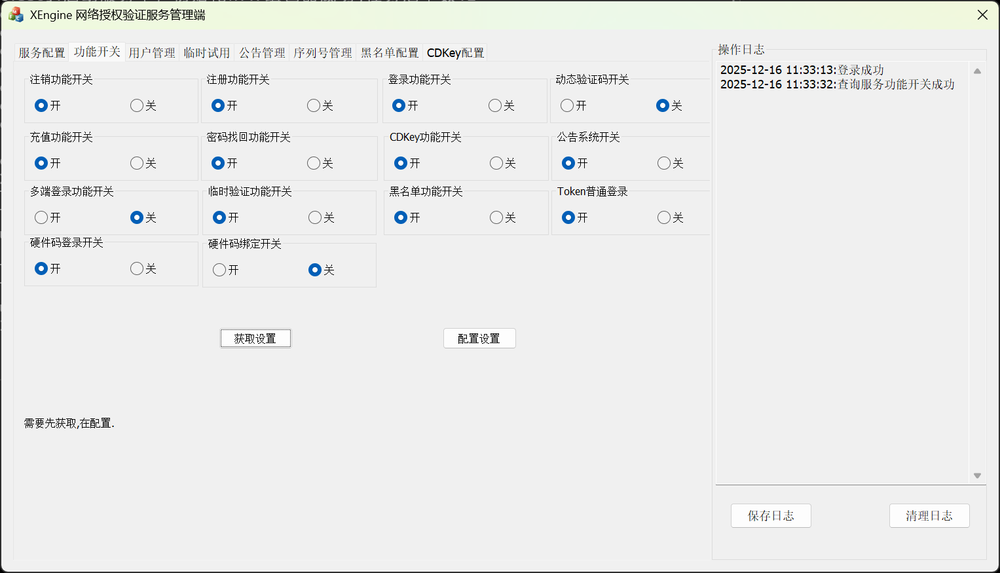

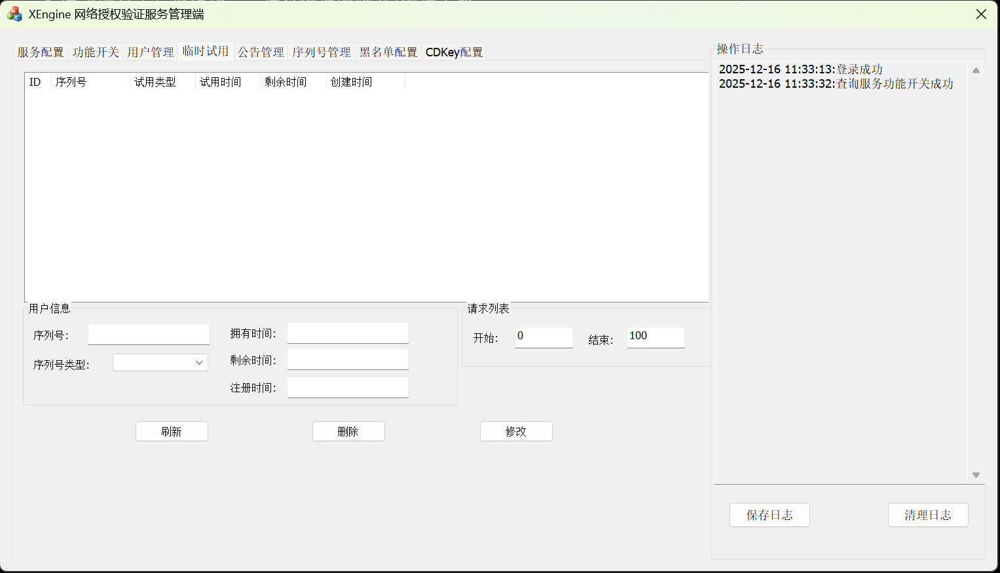
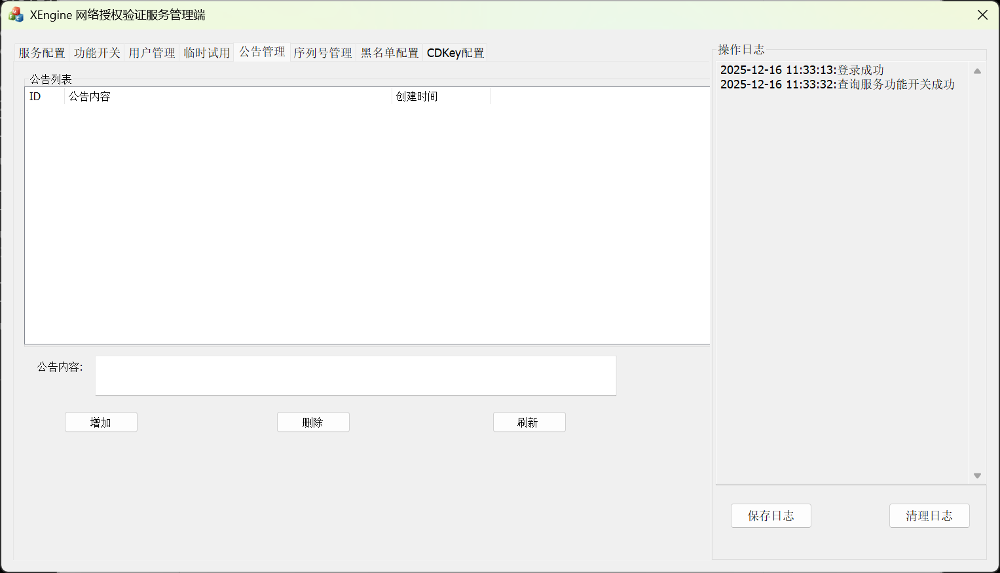
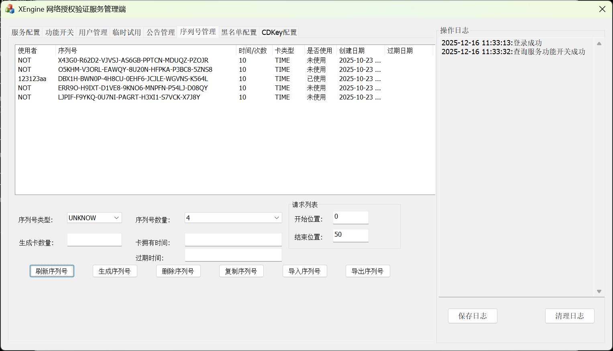
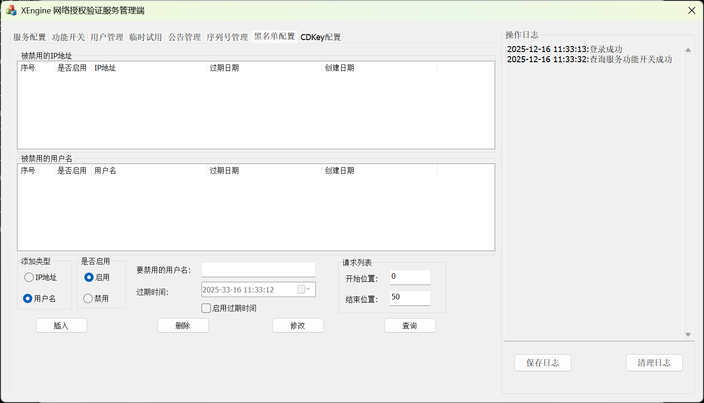
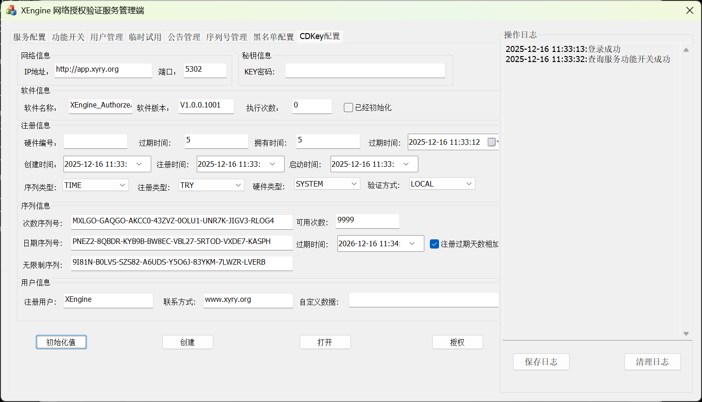

## 无代码授权验证支持
#### 程序打包服务
如果你没有开发软件能力或者不想自己实现或者想给其他软件添加授权验证,我们也提供了授权打包服务,这个服务可以直接让你的程序打包我们的验证.  
程序打包服务是一个付费服务,你可以为任意程序打包加验证.不需要源代码不修改你的程序就可以集成我们的验证服务,当打包完成后,当下次运行,就会先运行我们的验证客户端,验证通过后再运行你提供的程序,非常方便使用.  
此服务需要付费,200元3次,不限制x86或者x64位程序,你只需要告诉我们你的服务器地址端口验证模式即可.流程如下:  
付费->发送程序给我们->我们打包->测试验证->发送打包程序给你->完成  
当打包后,运行程序会优先打开下面的窗口,登录成功后才会启动你的程序,如下图,开启后会显示主界面,登录后主界面会关闭,然后启动你的程序  
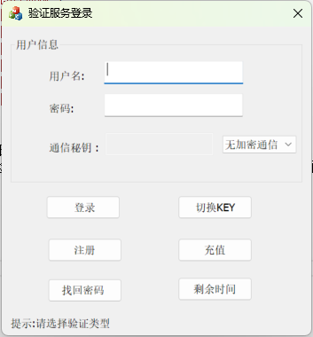  
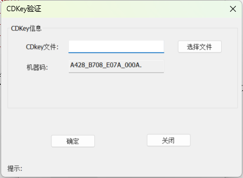  
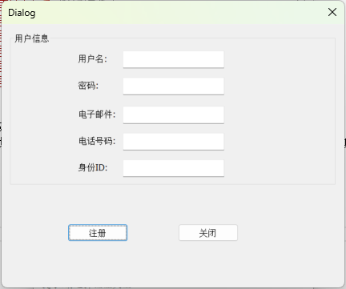  
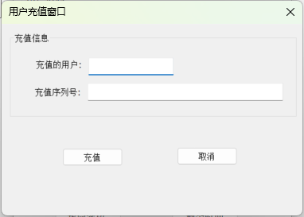  
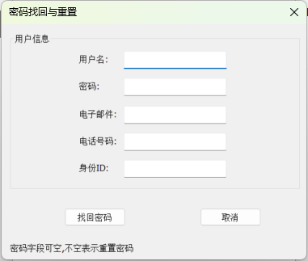  
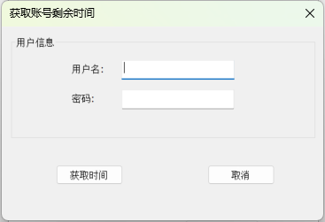  

会自动结束验证计时.支持登录,本地CDKEY验证,注册,充值,找回密码,获取剩余时间.  
注意:此功能只是替代打包,如果你想要完全的加密加壳安全性高的,必须自己使用代码开发.  
#### 打包器
我们也可以提供原始打包器,如果你有更多打包需求.打包器目前优惠活动中,500元.  
可以选择我们的验证程序,然后选择你要打包的程序.在选择配置文件即可,支持自动更新程序图标为你的软件图标.  
配置文件支持配置加解密通信和验证模式  
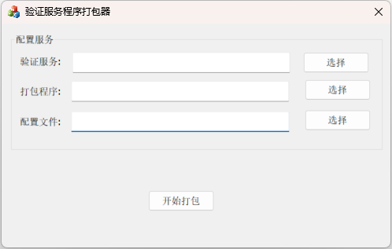  

## 参与贡献

1.  Fork 本仓库
2.  新建 Feat_xxx 分支
3.  提交代码
4.  新建 Pull Request 
5.  提交到develop分支

## 发展历程
V1版本为XEngine组件.大部分代码集中在XEngine中  
V2版本单独出来了所有相关模块,单独开发  
V3版本为全新版本,为了适应过多环境要求开发  

## 更新指导
数据库更新使用Navicat等数据库软件打开判断表和字段不同的地方进行修改  
修改完毕后直接把数据库拷贝到新的版本进行覆盖,修改你的配置文件即可  
3.19新增加了序列号过期字段

## 视频教程
你也可以观看视频教程来了解我们的代码框架情况:https://www.bilibili.com/video/BV1iF4m177aG

## 关注我们
如果你觉得这个软件对你有帮助,请你给我们一个START吧  
也可以通过微信关注我们  

## 提交问题

如果你有问题,可以在issues中提交
